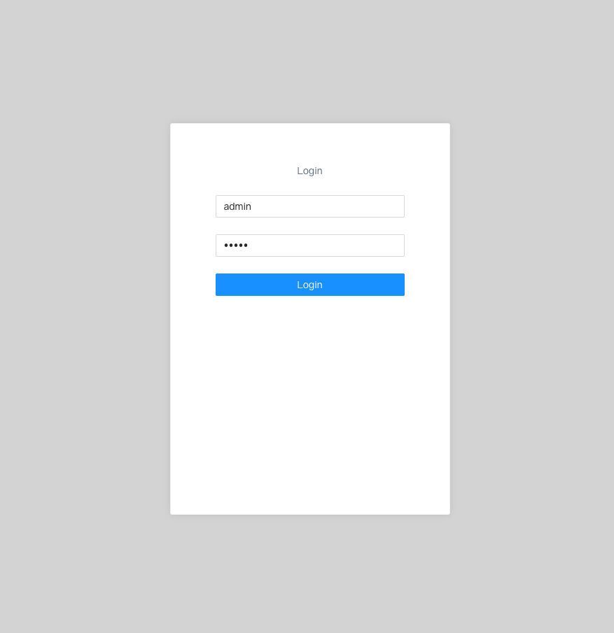
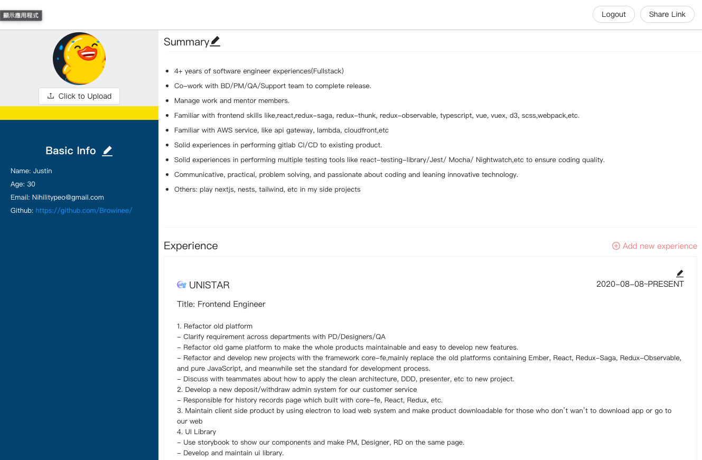
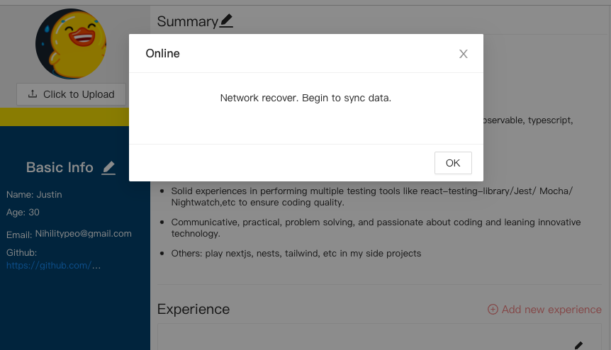
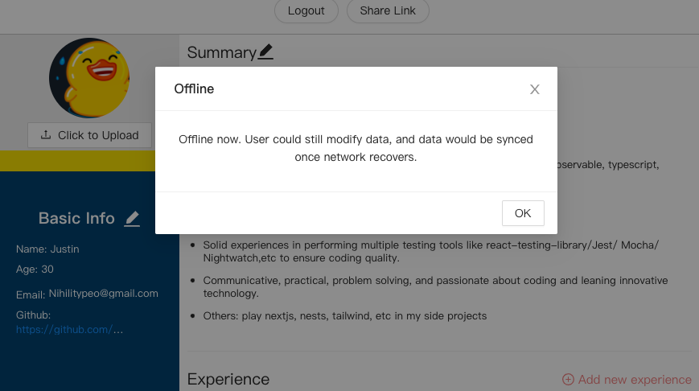

# Profile

This is a application about my resume. User should enter username and password to login.
After logging in as admin, user can view and modify each part including avatar, basic info
summary, experience. Also, user could create a share link which is easy to memorize and share.

BTW, I use a duck as avatar because I feel shy putting my avatar online.

## Demo

https://profile-six-rho.vercel.app/#/

## Feature

- Login
  - admin/admin with all the authorities
    
- Profile
  - Admin user has all permissions and can view and edit each part.
  - Avatar: user could upload avatar.
  - Summary: user could add or remove summary.
  - Experience: user can update or remove or add new experience.
- Vanity url
  - User could create new shared url and give authority on each part.
  - After creating url, user could enter the url on new tab and see the result.
- Authorization/Authentication
  - Login page
  - Feature toggle to control each part(white or back pencil).
    
- Online/Offline  
  
  
- Use msw as backend server and use localstorage as db.

##Setup

```shell


 yarn

 yarn start
```
